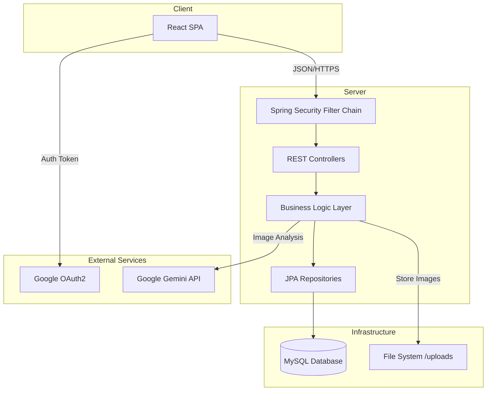
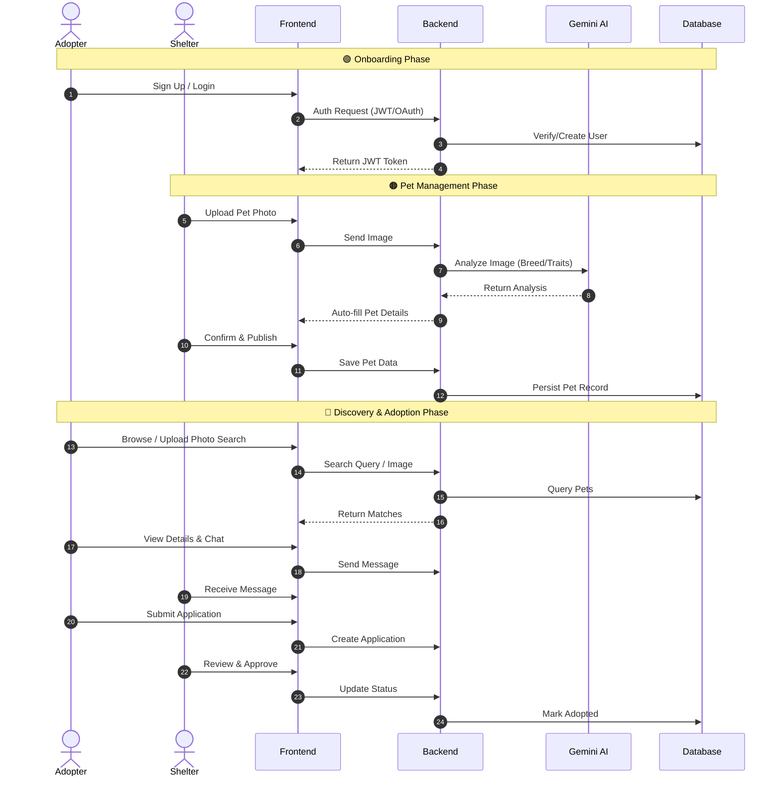

<div align="center">

# 🐾 Fur & Feathers
### Next-Gen Full-Stack Pet Adoption Platform


<br />

**Fur & Feathers** bridges the gap between shelters and adopters through technology.
<br />
**AI-Powered Recognition** • **Real-Time Messaging** • **Seamless UX**

[View Demo](#-visual-tour) • [Report Bug](https://github.com/SaddamHussainSafi/furandfeathers/issues) • [Request Feature](https://github.com/SaddamHussainSafi/furandfeathers/issues)

</div>

---

## 📖 Table of Contents

*   [🌟 Key Features](#-key-features)
*   [📸 Visual Tour](#-visual-tour)
*   [🛠️ Tech Stack](#-tech-stack-deep-dive)
*   [🏗️ Architecture](#-system-architecture)
*   [🚀 Setup Guide](#-comprehensive-setup-guide)
*   [🔌 API Reference](#-api-reference)
*   [📂 Structure](#-project-structure)
*   [👥 Team](#-team-members)

---

## 🌟 Key Features

<table>
  <tr>
    <td width="33%" valign="top">
      <h3 align="center">🧠 AI Discovery</h3>
      <p align="center">Upload a photo and let our <strong>Google Gemini-powered AI</strong> find your perfect pet match based on breed and features.</p>
    </td>
    <td width="33%" valign="top">
      <h3 align="center">💬 Real-Time Chat</h3>
      <p align="center">Instant communication between adopters and shelters. Ask questions, schedule visits, and get updates.</p>
    </td>
    <td width="33%" valign="top">
      <h3 align="center">🔐 Secure RBAC</h3>
      <p align="center">Tailored experiences for <strong>Adopters</strong>, <strong>Shelters</strong>, and <strong>Admins</strong> with robust security.</p>
    </td>
  </tr>
</table>

<details>
<summary><strong>🐶 Adopter Experience</strong></summary>

*   **Smart Search**: Filter by breed, age, size, and temperament.
*   **Favorites & Watchlist**: Save pets to review later.
*   **Application Tracking**: Real-time status updates on adoption requests.
</details>

<details>
<summary><strong>🏠 Shelter Dashboard</strong></summary>

*   **Inventory Management**: CRUD operations for pet listings with rich media support.
*   **Application Workflow**: Review, approve, or reject applications with one click.
*   **Analytics**: Visualize profile views and application trends.
</details>

<details>
<summary><strong>🛡️ Admin Control Center</strong></summary>

*   **User Oversight**: Manage shelter verifications and user bans.
*   **Platform Health**: Monitor system-wide statistics and activity logs.
</details>

---

## 📸 Visual Tour

> **Note**: Drop your screenshots into `backend/uploads/screenshots/` with the filenames below to see them here.

### 🏠 Core Experience
| | |
|:---:|:---:|
|  <br> **Homepage** <br> Immersive landing with video background. |  <br> **Authentication** <br> Secure login with JWT & Google OAuth. |
|  <br> **User Profile** <br> Manage settings and favorites. |  <br> **Messaging System** <br> Direct communication. |

### 🐾 Pet Discovery
| | |
|:---:|:---:|
|  <br> **Available Pets** <br> Browse all adoptable friends. |  <br> **Featured Pets** <br> Highlighted pets looking for homes. |
|  <br> **Pet Details** <br> Comprehensive info and stats. |  <br> **Related Pets** <br> Smart suggestions based on viewing history. |
|  <br> **Recommendations** <br> Personalized matches. |  <br> **Playful Content** <br> Engaging UI elements. |

### 🧠 AI Features
| | |
|:---:|:---:|
|  <br> **AI Pet Detection** <br> Upload a photo to find lookalikes. |  <br> **AI Chat Assistant** <br> Get instant answers about pets. |

### 🛡️ Shelter & Admin Management
| | |
|:---:|:---:|
|  <br> **Dashboard** <br> Overview of platform metrics. |  <br> **Pet Management** <br> Inventory control center. |
|  <br> **Add Pet (Step 1)** <br> Basic information entry. |  <br> **Add Pet (Step 2)** <br> Detailed attributes. |
|  <br> **Pet Approvals** <br> Admin review workflow. |  <br> **User Management** <br> Administer user roles. |

---

## 🛠️ Tech Stack Deep Dive

<table>
  <tr>
    <td valign="top" width="50%">
      <h3 align="center">Frontend (Client-Side)</h3>
      <ul>
        <li><strong>React 18</strong>: Component-based UI architecture.</li>
        <li><strong>Vite</strong>: Lightning-fast build tool.</li>
        <li><strong>Tailwind CSS</strong>: Utility-first styling.</li>
        <li><strong>Framer Motion & GSAP</strong>: Smooth animations.</li>
        <li><strong>Axios</strong>: HTTP client with interceptors.</li>
        <li><strong>Context API</strong>: Global state management.</li>
      </ul>
    </td>
    <td valign="top" width="50%">
      <h3 align="center">Backend (Server-Side)</h3>
      <ul>
        <li><strong>Spring Boot 3</strong>: Production-ready Java framework.</li>
        <li><strong>Spring Security</strong>: Robust auth & authorization.</li>
        <li><strong>Spring Data JPA</strong>: Hibernate abstraction.</li>
        <li><strong>Google Gemini API</strong>: Multimodal AI analysis.</li>
        <li><strong>Lombok</strong>: Boilerplate reduction.</li>
        <li><strong>MySQL 8.0</strong>: Relational database.</li>
      </ul>
    </td>
  </tr>
</table>

---

## 🏗️ System Architecture

The application follows a **Monolithic Architecture** with clear separation of concerns, designed to be easily split into microservices if needed.



---

## 🔄 User Journey & Workflow

The platform facilitates a seamless journey from initial signup to finalizing an adoption.



---

## 🚀 Comprehensive Setup Guide

### Prerequisites
Ensure you have the following installed:
*   **Java Development Kit (JDK) 17+**
*   **Node.js 18+** & **npm**
*   **MySQL Server 8.0+**
*   **Git**

### 1. Clone & Prepare
```bash
git clone https://github.com/yourusername/furandfeathers.git
cd furandfeathers
```

### 2. Database Configuration
Log in to your MySQL shell and create the database:
```sql
CREATE DATABASE testtt;
-- Ensure your user has privileges
GRANT ALL PRIVILEGES ON testtt.* TO 'root'@'localhost';
FLUSH PRIVILEGES;
```

### 3. Backend Configuration
Navigate to `backend/src/main/resources/application.properties` and configure:

| Property | Description | Example Value |
| :--- | :--- | :--- |
| `spring.datasource.username` | DB Username | `root` |
| `spring.datasource.password` | DB Password | `password123` |
| `google.client.id` | Google OAuth Client ID | `12345...apps.googleusercontent.com` |
| `google.api.key` | Gemini AI API Key | `AIzaSy...` |
| `app.jwt.secret` | JWT Signing Key | `super_secret_key_at_least_32_chars` |

### 4. Launch Backend
```bash
cd backend
# Windows
.\mvnw.cmd spring-boot:run
# Mac/Linux
./mvnw spring-boot:run
```
*Server will start on `http://localhost:8080`*

### 5. Frontend Configuration
Create a `.env` file in the `frontend/` directory:
```env
VITE_BACKEND_BASE_URL=http://localhost:8080
VITE_API_BASE_URL=http://localhost:8080/api
VITE_GOOGLE_CLIENT_ID=your_google_client_id_here
```

### 6. Launch Frontend
```bash
cd frontend
npm install
npm run dev
```
*App will open at `http://localhost:5173`*

---

## 🔌 API Reference

Here are the primary endpoints used by the application.

### **Authentication**
*   `POST /api/auth/register` - Register a new user (Adopter/Shelter).
*   `POST /api/auth/login` - Authenticate and receive JWT.
*   `POST /api/auth/google` - Login with Google OAuth.

### **Pets**
*   `GET /api/pets` - Retrieve paginated list of pets.
*   `GET /api/pets/{id}` - Get detailed pet profile.
*   `POST /api/pets` - (Shelter) Create a new pet listing.
*   `PUT /api/pets/{id}` - (Shelter) Update pet details.
*   `DELETE /api/pets/{id}` - (Shelter) Remove a listing.

### **Applications**
*   `POST /api/applications` - Submit an adoption request.
*   `GET /api/applications/user/{userId}` - Get user's application history.
*   `PUT /api/applications/{id}/status` - (Shelter) Approve/Reject application.

### **AI Services**
*   `POST /api/ai/analyze` - Upload image for breed/feature detection.

---

## 📂 Project Structure

A detailed look at the project's organization:

```
furandfeathers/
├── backend/                 # Spring Boot Application
│   ├── src/main/java/com/furandfeathers/
│   │   ├── config/          # Security (JWT, OAuth) & App Config
│   │   ├── controller/      # REST API Endpoints (Auth, Pets, Applications)
│   │   ├── dto/             # Data Transfer Objects (Request/Response)
│   │   ├── entity/          # JPA Entities (User, Pet, Application)
│   │   ├── repository/      # Spring Data JPA Repositories
│   │   ├── service/         # Business Logic & AI Integration
│   │   └── util/            # Utility classes
│   ├── src/main/resources/  # Application properties & SQL scripts
│   └── uploads/             # Local storage for user uploads & assets
├── frontend/                # React Application
│   ├── public/              # Static assets
│   ├── src/
│   │   ├── api/             # Axios setup & API service calls
│   │   ├── assets/          # Images, Lottie animations, Icons
│   │   ├── components/      # Reusable UI Components
│   │   │   ├── cards/       # Pet & Info Cards
│   │   │   ├── charts/      # Dashboard Visualizations
│   │   │   ├── forms/       # Auth & Data Entry Forms
│   │   │   ├── layout/      # Navbar, Sidebar, Footer
│   │   │   └── ui/          # Buttons, Modals, Loaders
│   │   ├── context/         # Global State (AuthContext)
│   │   ├── hooks/           # Custom Hooks (useGoogleMaps, etc.)
│   │   ├── pages/           # Route Pages (Home, Dashboard, PetDetails)
│   │   ├── styles/          # Global CSS & Tailwind Config
│   │   └── utils/           # Helper functions
│   ├── .env                 # Environment variables
│   └── package.json         # Dependencies & Scripts
└── README.md                # Project Documentation
```

---

## 📊 Project Stats

<div align="center">

| 📏 Total Lines of Code | 💻 Languages | 🧩 Components |
| :---: | :---: | :---: |
| **~28,000+** | **Java, JS, CSS, HTML, SQL** | **50+ React, 20+ Services** |

</div>

---

## 👥 Team Members

<div align="center">

| Name | Role | GitHub |
| :--- | :--- | :--- |
| **Saddam Hussain Safi** | Full Stack Developer | [@SaddamHussainSafi](https://github.com/SaddamHussainSafi) |
| **[Member Name]** | [Role] | [@username](https://github.com/username) |
| **[Member Name]** | [Role] | [@username](https://github.com/username) |
| **[Member Name]** | [Role] | [@username](https://github.com/username) |

</div>

---

## 🤝 Contributing

---

## 📖 Table of Contents

*   [🌟 Key Features](#-key-features)
*   [📸 Visual Tour](#-visual-tour)
*   [🛠️ Tech Stack Deep Dive](#-tech-stack-deep-dive)
*   [🏗️ System Architecture](#-system-architecture)
*   [🚀 Comprehensive Setup Guide](#-comprehensive-setup-guide)
*   [⚙️ Configuration & Environment](#-configuration--environment)
*   [🔌 API Reference](#-api-reference)
*   [📂 Project Structure](#-project-structure)
*   [🤝 Contributing](#-contributing)

---

## 🌟 Key Features

### 🧠 AI-Powered Discovery
Upload a photo of a pet you love, and our **Google Gemini-powered AI** will analyze the breed, color, and features to find similar adoptable pets in our database. It's like Shazam for pets!

### 💬 Real-Time Communication
Built-in chat functionality allows adopters to ask questions directly to shelters without leaving the platform.
*   **Adopters**: Inquire about pet personality, health, and history.
*   **Shelters**: Manage inquiries efficiently and schedule visits.

### 🔐 Role-Based Access Control (RBAC)
A secure environment tailored to every user type:
<details>
<summary><strong>🐶 Adopter Experience</strong></summary>

*   **Smart Search**: Filter by breed, age, size, and temperament.
*   **Favorites & Watchlist**: Save pets to review later.
*   **Application Tracking**: Real-time status updates on adoption requests.
</details>

<details>
<summary><strong>🏠 Shelter Dashboard</strong></summary>

*   **Inventory Management**: CRUD operations for pet listings with rich media support.
*   **Application Workflow**: Review, approve, or reject applications with one click.
*   **Analytics**: Visualize profile views and application trends.
</details>

<details>
<summary><strong>🛡️ Admin Control Center</strong></summary>

*   **User Oversight**: Manage shelter verifications and user bans.
*   **Platform Health**: Monitor system-wide statistics and activity logs.
</details>

---

## 📸 Visual Tour

### 🏠 Core Experience
| | |
|:---:|:---:|
| <br>**Homepage**<br>Immersive landing with video background. | <br>**Authentication**<br>Secure login with JWT & Google OAuth. |
| <br>**User Profile**<br>Manage settings and favorites. | <br>**Messaging System**<br>Direct communication. |

### 🐾 Pet Discovery
| | |
|:---:|:---:|
| <br>**Available Pets**<br>Browse all adoptable friends. | <br>**Featured Pets**<br>Highlighted pets looking for homes. |
| <br>**Pet Details**<br>Comprehensive info and stats. | <br>**Related Pets**<br>Smart suggestions based on viewing history. |
| <br>**Recommendations**<br>Personalized matches. | <br>**Playful Content**<br>Engaging UI elements. |

### 🧠 AI Features
| | |
|:---:|:---:|
| <br>**AI Pet Detection**<br>Upload a photo to find lookalikes. | <br>**AI Chat Assistant**<br>Get instant answers about pets. |

### 🛡️ Shelter & Admin Management
| | |
|:---:|:---:|
| <br>**Dashboard**<br>Overview of platform metrics. | <br>**Pet Management**<br>Inventory control center. |
| <br>**Add Pet (Step 1)**<br>Basic information entry. | <br>**Add Pet (Step 2)**<br>Detailed attributes. |
| <br>**Pet Approvals**<br>Admin review workflow. | <br>**User Management**<br>Administer user roles. |

---

## 🛠️ Tech Stack Deep Dive

### **Frontend (Client-Side)**
*   **React 18**: Component-based UI architecture.
*   **Vite**: Lightning-fast build tool and dev server.
*   **Tailwind CSS**: Utility-first styling for rapid design implementation.
*   **Framer Motion & GSAP**: Smooth, complex animations for a polished feel.
*   **Axios**: Promise-based HTTP client with interceptors for JWT handling.
*   **Context API**: Global state management for Authentication and Theme.

### **Backend (Server-Side)**
*   **Spring Boot 3**: Production-ready Java framework.
*   **Spring Security**: Robust authentication and authorization.
*   **Spring Data JPA**: Abstraction over Hibernate for database interactions.
*   **Google Gemini API**: Multimodal AI for image analysis.
*   **Lombok**: Reduces boilerplate code (Getters, Setters, Builders).

### **Database**
*   **MySQL 8.0**: Relational database for structured data (Users, Pets, Applications).

---

## 🏗️ System Architecture

The application follows a **Monolithic Architecture** with clear separation of concerns, designed to be easily split into microservices if needed.


---

## 🔄 User Journey & Workflow

The platform facilitates a seamless journey from initial signup to finalizing an adoption.


---

## 🚀 Comprehensive Setup Guide

### Prerequisites
Ensure you have the following installed:
*   **Java Development Kit (JDK) 17+**
*   **Node.js 18+** & **npm**
*   **MySQL Server 8.0+**
*   **Git**

### 1. Clone & Prepare
```bash
git clone https://github.com/yourusername/furandfeathers.git
cd furandfeathers
```

### 2. Database Configuration
Log in to your MySQL shell and create the database:
```sql
CREATE DATABASE testtt;
-- Ensure your user has privileges
GRANT ALL PRIVILEGES ON testtt.* TO 'root'@'localhost';
FLUSH PRIVILEGES;
```

### 3. Backend Configuration
Navigate to `backend/src/main/resources/application.properties` and configure:

| Property | Description | Example Value |
| :--- | :--- | :--- |
| `spring.datasource.username` | DB Username | `root` |
| `spring.datasource.password` | DB Password | `password123` |
| `google.client.id` | Google OAuth Client ID | `12345...apps.googleusercontent.com` |
| `google.api.key` | Gemini AI API Key | `AIzaSy...` |
| `app.jwt.secret` | JWT Signing Key | `super_secret_key_at_least_32_chars` |

### 4. Launch Backend
```bash
cd backend
# Windows
.\mvnw.cmd spring-boot:run
# Mac/Linux
./mvnw spring-boot:run
```
*Server will start on `http://localhost:8080`*

### 5. Frontend Configuration
Create a `.env` file in the `frontend/` directory:
```env
VITE_BACKEND_BASE_URL=http://localhost:8080
VITE_API_BASE_URL=http://localhost:8080/api
VITE_GOOGLE_CLIENT_ID=your_google_client_id_here
```

### 6. Launch Frontend
```bash
cd frontend
npm install
npm run dev
```
*App will open at `http://localhost:5173`*

---

## 🔌 API Reference

Here are the primary endpoints used by the application.

### **Authentication**
*   `POST /api/auth/register` - Register a new user (Adopter/Shelter).
*   `POST /api/auth/login` - Authenticate and receive JWT.
*   `POST /api/auth/google` - Login with Google OAuth.

### **Pets**
*   `GET /api/pets` - Retrieve paginated list of pets.
*   `GET /api/pets/{id}` - Get detailed pet profile.
*   `POST /api/pets` - (Shelter) Create a new pet listing.
*   `PUT /api/pets/{id}` - (Shelter) Update pet details.
*   `DELETE /api/pets/{id}` - (Shelter) Remove a listing.

### **Applications**
*   `POST /api/applications` - Submit an adoption request.
*   `GET /api/applications/user/{userId}` - Get user's application history.
*   `PUT /api/applications/{id}/status` - (Shelter) Approve/Reject application.

### **AI Services**
*   `POST /api/ai/analyze` - Upload image for breed/feature detection.

---

## 📂 Project Structure

A detailed look at the project's organization:

```
furandfeathers/
├── backend/                 # Spring Boot Application
│   ├── src/main/java/com/furandfeathers/
│   │   ├── config/          # Security (JWT, OAuth) & App Config
│   │   ├── controller/      # REST API Endpoints (Auth, Pets, Applications)
│   │   ├── dto/             # Data Transfer Objects (Request/Response)
│   │   ├── entity/          # JPA Entities (User, Pet, Application)
│   │   ├── repository/      # Spring Data JPA Repositories
│   │   ├── service/         # Business Logic & AI Integration
│   │   └── util/            # Utility classes
│   ├── src/main/resources/  # Application properties & SQL scripts
│   └── uploads/             # Local storage for user uploads & assets
├── frontend/                # React Application
│   ├── public/              # Static assets
│   ├── src/
│   │   ├── api/             # Axios setup & API service calls
│   │   ├── assets/          # Images, Lottie animations, Icons
│   │   ├── components/      # Reusable UI Components
│   │   │   ├── cards/       # Pet & Info Cards
│   │   │   ├── charts/      # Dashboard Visualizations
│   │   │   ├── forms/       # Auth & Data Entry Forms
│   │   │   ├── layout/      # Navbar, Sidebar, Footer
│   │   │   └── ui/          # Buttons, Modals, Loaders
│   │   ├── context/         # Global State (AuthContext)
│   │   ├── hooks/           # Custom Hooks (useGoogleMaps, etc.)
│   │   ├── pages/           # Route Pages (Home, Dashboard, PetDetails)
│   │   ├── styles/          # Global CSS & Tailwind Config
│   │   └── utils/           # Helper functions
│   ├── .env                 # Environment variables
│   └── package.json         # Dependencies & Scripts
└── README.md                # Project Documentation
```

---

## 📊 Project Stats

*   **Total Lines of Code**: ~28,000+
*   **Languages**: Java, JavaScript, CSS, HTML, SQL
*   **Core Components**: 50+ React Components, 20+ Backend Services

---

## 👥 Team Members

| Name | Role | GitHub |
| :--- | :--- | :--- |
| **Saddam Hussain Safi** | Full Stack Developer | [@SaddamHussainSafi](https://github.com/SaddamHussainSafi) |
| **[Ashutosh Mishra]** | [Role] | [@username](https://github.com/username) |
| **[Nimesh Neupane]** | [Role] | [@username](https://github.com/username) |
| **[Sandip Khatri]** | [Role] | [@username](https://github.com/username) |

---

## 🤝 Contributing

We welcome contributions! Please follow these steps:

1.  **Fork** the repository.
2.  Create a **Feature Branch** (`git checkout -b feature/NewFeature`).
3.  **Commit** your changes (`git commit -m 'Add some NewFeature'`).
4.  **Push** to the branch (`git push origin feature/NewFeature`).
5.  Open a **Pull Request**.

---

## 📄 License

Distributed under the MIT License. See `LICENSE` for more information.

